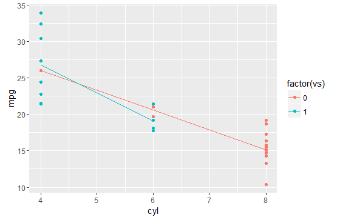

# ggplot2Animint

[](https://travis-ci.org/faizan-khan-iit/ggplot2)

## Overview

ggplot2Animint is the customized version of ggplot2 which passes the static plots generated by it for rendering. It is [animint2](https://github.com/tdhock/animint2) specific version of ggplot2. It has been done so to avoid WARNINGS from constant changes in new version of ggplot2 as animint2 earlier depend on it and also to avoid error from functions that are non-specific to animint code base. 

ggplot2Animint also drops major dependency packages that can be directly imported to animint2.


Major Update: ggplot2Animint is now compatable with other base packages in RStudio with changes in [ggproto function](https://github.com/faizan-khan-iit/ggplot2/pull/7)
 
Package is ready for CRAN submission.

## Installation


```R
# install.packages("devtools")
devtools::install_github("faizan-khan-iit/ggplot2@e62066b462070a3a46f403d6f63531413a3a20ce")
```


#About ggpolot2

ggplot2 is a plotting system for R, based on the grammar of graphics, which tries to take the good parts of base and lattice graphics and avoid bad parts. It takes care of many of the fiddly details that make plotting a hassle (like drawing legends) as well as providing a powerful model of graphics that makes it easy to produce complex multi-layered graphics.


Find out more at <http://ggplot2.org>, and check out the nearly 500
examples of ggplot in use.  If you're interested, you can also sign up to
the ggplot2 mailing list at <https://groups.google.com/group/ggplot2>.

If you looking for ggplot2 offical repository, visit at <https://github.com/tidyverse/ggplot2>

## Usage
The syntax and major functions like ```ggplot()``` and layers like ```geom_point()``` or ```geom_histogram()```, scales (like ```scale_colour_brewer()```) remains same. 

```R
library(ggplot2Animint)

ggplot(mtcars, aes(cyl, mpg)) + 
geom_point() + aes(colour = factor(vs)) + stat_summary(fun.y = mean, geom="line")

```

<!-- -->
